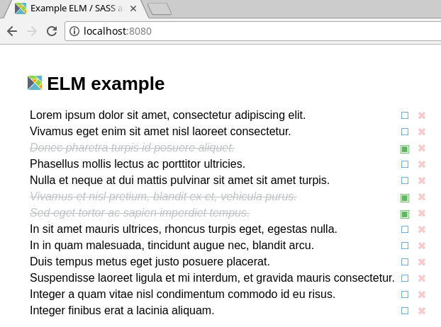

# starter-elm-sass
My template project for ELM / SASS projects.


## Objectives

* no external dependencies (no npm -g)
* ELM 0.18
* SASS
* elm-test
* hot reloading development server
* simple webpack configuration file
* separated examples


## Usage

To start the development server:

```shell
$ npm i
$ npm run dev
```

Open [localhost:8080](http://localhost:8080).

Basic TodoList viewer example:



To build a production release to the `dist` folder:


```shell
$ npm i
$ npm run dist

```

To start the ELM REPL:

```shell
$ npm run repl
```

To run the tests:

```shell
$ npm run test
```

## Structure

```
starter-elm-sass
├── elm-package.json
├── examples
│   ├── favicon.ico
│   ├── index.html
│   ├── index.js
│   └── src
│       └── Example.elm
├── LICENSE
├── package.json
├── package-lock.json
├── README.md
├── src
│   └── App.elm
├── styles
│   ├── all.scss
│   ├── colors.scss
│   └── mixins.scss
├── tests
│   ├── elm-package.json
│   └── TestApp.elm
└── webpack.config.js
```

## References

* [elm-loader](https://github.com/elm-community/elm-webpack-loader)
* [elm-webpack-starter](https://github.com/elm-community/elm-webpack-starter)

## License

This project is licensed under [MIT](./LICENSE).
